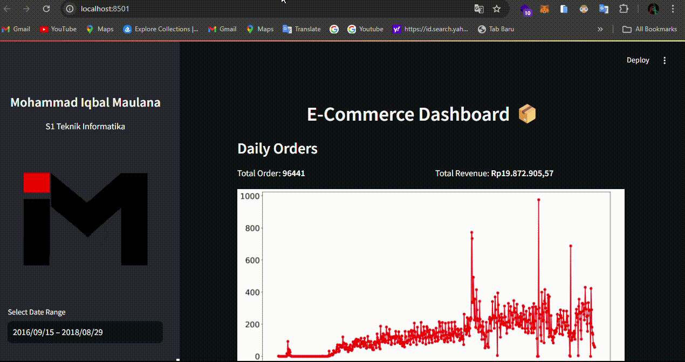

# E-Commerce Public Data Analysis with Python - Dicoding



[E-Commerce Data Dashboard Streamlit App]()

## Table of Contents

- [Overview](#overview)
- [Project Structure](#project-structure)
- [Installation](#installation)
- [Usage](#usage)
- [Data Sources](#data-sources)

## Overview

This project focuses on analyzing and visualizing public e-commerce data, featuring comprehensive data wrangling and exploratory data analysis (EDA) techniques. It also includes an interactive Streamlit dashboard, allowing users to explore and interact with the dataset, offering deeper insights into the trends and patterns of the e-commerce sector.

## Project Structure

- `dashboard/`: This directory contains dashboard.py which is used to create dashboards of data analysis results.
- `Dataset/`: Directory containing the raw CSV data files.
- `dashboard-proyek-analisis-data-dicoding.gif`: gif file of dashboard results display
- `.gitignore/`: This file lists the files and directories that should be ignored by Git version control.
- `Proyek_Analisiss_Data.ipynb`: This file is used to perform data analysis.
- `README.md`: This documentation file.
- `requirements.txt`: A file that lists all the dependencies and packages needed to run the project.

## Installation

1. Clone this repository to your local machine:

```
git clone https://github.com/mhdhfzz/data-analyst-dicoding.git
```

2. Go to the project directory

```
cd data-analyst-dicoding
```

3. Install the required Python packages by running:

```
pip install -r requirements.txt
```

## Usage

1. **Data Wrangling**: Data wrangling scripts are available in the `notebook.ipynb` file to prepare and clean the data.

2. **Exploratory Data Analysis (EDA)**: Explore and analyze the data using the provided Python scripts. EDA insights can guide your understanding of e-commerce public data patterns.

3. **Visualization**: Run the Streamlit dashboard for interactive data exploration:

```
cd data-analyst-dicoding/dashboard
streamlit run dashboard.py
```

Access the dashboard in your web browser at `http://localhost:8501`.

## Data Sources

The project uses E-Commerce Public Dataset from [Belajar Analisis Data dengan Python's Final Project](https://drive.google.com/file/d/1MsAjPM7oKtVfJL_wRp1qmCajtSG1mdcK/view) offered by [Dicoding](https://www.dicoding.com/).
